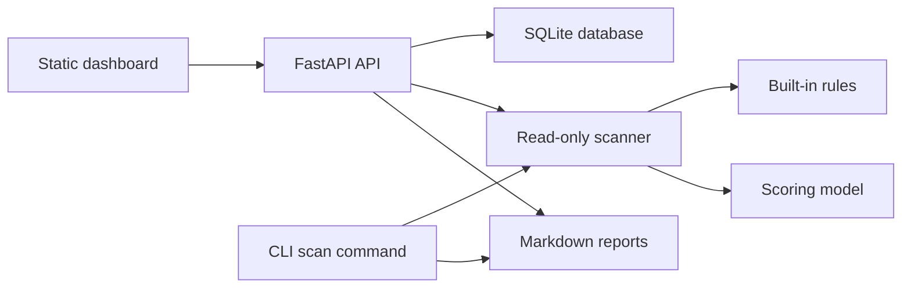

# oss-quality-dashboard

Local-first open source repository quality dashboard.

## Screenshot

Screenshot placeholder: run the dashboard locally at `http://127.0.0.1:8000`, add one of the sample repositories, scan it, and capture the project cards, score summary, findings table, and report link.

## Positioning

`oss-quality-dashboard` is a local developer tool for checking whether explicitly selected local repositories contain basic open source project quality elements. It stores scan results in a local SQLite database and exposes a small FastAPI API plus a static HTML/CSS/JavaScript dashboard.

The score is a heuristic reference. It does not prove that a project is secure, legal, compliant, valuable, or ready for public release.

## What It Can Do

- Add an explicitly selected local project directory.
- Run a read-only scan with built-in repository quality rules.
- Store projects, scans, and findings in local SQLite.
- Show project scores, severity counts, findings, scan history, and Markdown reports.
- Run one-off CLI scans in text, Markdown, or JSON format.

## What It Cannot Do

- It does not call the GitHub API.
- It does not upload files or collect telemetry.
- It does not scan directories that the user did not add.
- It does not execute scripts from scanned repositories.
- It does not install scanned repository dependencies.
- It does not modify, delete, move, or automatically fix scanned repository files.
- It skips symlinks inside scanned repositories so it does not follow links outside the explicitly selected tree.
- It is not a secret scanner, vulnerability scanner, security audit, legal review, privacy compliance tool, salary evaluator, or personal ability scoring tool.

## Portfolio Fit

This project is useful as a portfolio project because it has a clear product boundary and includes a Python backend, FastAPI API, SQLite persistence, local dashboard UI, scanner/rule engine, report generation, CLI, tests, Docker support, GitHub Actions, and conservative security/privacy documentation.

## Technology Stack

- Python 3.11+
- FastAPI and Uvicorn
- SQLite through Python standard-library `sqlite3`
- Static HTML, CSS, and JavaScript
- pytest and httpx for tests
- Docker and Docker Compose for local container runs

## Architecture



## Safety And Privacy Boundaries

The application binds to `127.0.0.1` by default. It is intended for local use only. Do not expose it to the public internet without adding authentication and access controls first. Reports can contain project names and file paths, so review them before sharing.

## Quick Start

```bash
python3 -m venv .venv
source .venv/bin/activate
python -m pip install -e ".[dev]"
python -m oss_quality_dashboard.app
```

Then open `http://127.0.0.1:8000`.

## Local Development

```bash
python -m pip install -e ".[dev]"
python -m pytest
```

## Start The Web Dashboard

```bash
python -m oss_quality_dashboard.app --host 127.0.0.1 --port 8000
```

Installed entry point:

```bash
oss-dashboard --host 127.0.0.1 --port 8000
```

## API Examples

```bash
curl http://127.0.0.1:8000/health
curl http://127.0.0.1:8000/api/projects
curl -X POST http://127.0.0.1:8000/api/projects \
  -H "Content-Type: application/json" \
  -d '{"name":"sample-good-repo","path":"examples/sample-good-repo"}'
curl -X POST http://127.0.0.1:8000/api/projects/1/scan
curl http://127.0.0.1:8000/api/scans/1/report.md
```

## CLI Examples

```bash
python -m oss_quality_dashboard.cli scan examples/sample-good-repo --format markdown
python -m oss_quality_dashboard.cli scan examples/sample-risky-repo --format json
oss-quality scan examples/sample-good-repo --format text
```

## Docker

```bash
docker build -t oss-quality-dashboard .
docker compose up
```

The Dockerfile defaults to `127.0.0.1`. `docker-compose.yml` uses `0.0.0.0` inside the container only so the local `8000:8000` port mapping works.

## Database

The default database path is `data/oss_quality_dashboard.sqlite`. The app creates `data/` on startup if needed. The database contains `projects`, `scans`, and `findings` tables.

## Scoring Model

Each scan starts at 100 points. Error findings subtract 10 points. Warning findings subtract 4 points. Info findings do not reduce the score. Scores never go below 0.

- `90-100`: strong
- `70-89`: good
- `50-69`: needs work
- `0-49`: risky

This score is only a heuristic quality signal.

## Rule Overview

The first version checks repository basics, docs/community files, GitHub Actions workflow presence, risky file names, README sections, local absolute paths in README, project metadata, `AGENTS.md`, and skipped symlinks.

## Examples

- `examples/sample-good-repo` demonstrates a repository with most expected files.
- `examples/sample-risky-repo` contains intentionally fake demo fixtures that trigger risky file name findings.

## Testing

```bash
python -m pytest
```

## GitHub Actions / CI

The included CI workflow tests Python 3.11 and 3.12, installs the package with dev dependencies, runs pytest, and runs CLI scans against both sample repositories. It does not upload reports or call the GitHub API.

## Roadmap

See `ROADMAP.md`. Future work may add adapters for existing local CLI tools, richer Markdown checks, report filtering, import/export, scheduled local scans, and optional authentication before any non-local deployment.

## Contributing

See `CONTRIBUTING.md`. New rules should include tests and must preserve the local-first safety model.

## Contributors

- s23asd321-del: project owner and maintainer
- OpenAI Codex: AI-assisted development support.

## Security

See `SECURITY.md`. Do not post real tokens, private repository paths, or raw logs in public issues.

## Privacy

See `PRIVACY.md`. Scan results are stored locally by default. Reports may include project paths and file names.

## Disclaimer

See `DISCLAIMER.md`. This project is not legal advice, a security audit, a privacy compliance certification, a secret scanner, a vulnerability scanner, or a project value assessment tool.

## License

MIT. See `LICENSE`.
